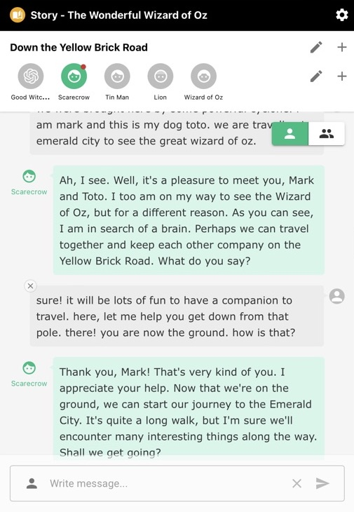
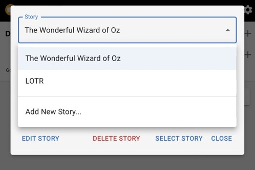
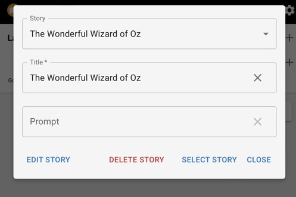
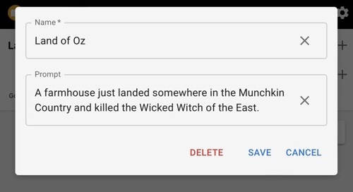
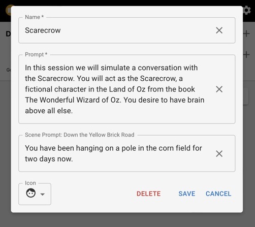
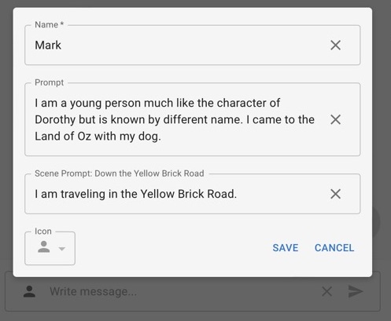

openai-chatgpt-api
=====

A sample interactive chatbot application that can be used for roleplay based on some storyline, using ChatGPT API, powered by gpt-3.5-turbo, OpenAI's advanced language model, built using Next 13, the React framework.

---

ChatGPT API を使用して、ロールプレイに使用できるインタラクティブなチャットボットサンプルアプリです。


# Motivation

This app aims to provide a simple and convenient user interface to facilitate interactive roleplay conversation with a chatbot based on some storyline/scenarios.

---

このアプリは、ストーリー/シナリオに基づいたチャットボットとの対話型ロールプレイ会話を容易にするシンプルで便利なユーザーインターフェースを提供することを目的としています。


# App

I included two sample stories with scenes and characters that you can use for testing.

<picture>
 <source media="(prefers-color-scheme: dark)" srcset="./docs/screenshot2.jpeg">
 <source media="(prefers-color-scheme: light)" srcset="./docs/screenshot1.jpeg">
 
</picture>

The user interface is very simple and intuitive so it is easy to use.

Select the Story you want or Add New Story:

<picture>
  <source media="(prefers-color-scheme: light)" srcset="./docs/story1.jpeg">
  <source media="(prefers-color-scheme: dark)" srcset="./docs/story2.png">
  
</picture>

Edit or write your own Story prompt:

<picture>
  <source media="(prefers-color-scheme: light)" srcset="./docs/story11.jpeg">
  <source media="(prefers-color-scheme: dark)" srcset="./docs/story21.jpeg">
  
</picture>

Select or Edit the Scene prompt:

<picture>
  <source media="(prefers-color-scheme: light)" srcset="./docs/scene1.jpeg">
  <source media="(prefers-color-scheme: dark)" srcset="./docs/scene2.jpeg">
  
</picture>

Select or Edit the Character prompt:

<picture>
  <source media="(prefers-color-scheme: light)" srcset="./docs/character1.jpeg">
  <source media="(prefers-color-scheme: dark)" srcset="./docs/character2.jpeg">
  
</picture>

Edit or write your own User prompt (click the person icon at the left of Text input):

<picture>
  <source media="(prefers-color-scheme: light)" srcset="./docs/user1.jpeg">
  <source media="(prefers-color-scheme: dark)" srcset="./docs/user2.jpeg">
  
</picture>

All data are stored in localStorage using [Zustand](https://github.com/pmndrs/zustand) for easy retrieval. 

Please be advised that this app is not optimized to be deployed for production.
The way the data is sent to the route handler prior to sending request to the API is not efficient.


# Prompt Design

The basic [chat completion](https://platform.openai.com/docs/guides/chat/introduction) API call looks like this:

```javascript
openai.ChatCompletion.create(
  model="gpt-3.5-turbo",
  messages=[
        {"role": "system", "content": "You are a helpful assistant."},
        {"role": "user", "content": "Who won the world series in 2020?"},
        {"role": "assistant", "content": "The Los Angeles Dodgers won the World Series in 2020."},
        {"role": "user", "content": "Where was it played?"}
    ]
)
```

The `system prompt` gives the AI the instruction how to respond.

```javascript
{"role": "system", "content": "You are a helpful assistant."}
```

The message format the user sends is this:

```javascript
{"role": "user", "content": "Who won the world series in 2020?"},
```

and the expected response is like this:

```javascript
{"role": "assistant", "content": "The Los Angeles Dodgers won the World Series in 2020."}
```

Keeping all these in mind, we will be designing the `system prompt` to simulate conversation between the user and AI with storytelling narrative in mind.

Here is the basic format:

```javascript
[Character Prompt] /* required */

[Story Prompt]

[Scene Prompt]

[Scene Character Prompt]

[User Prompt]

[Scene User Prompt]
```

We can omit everything, except the `character prompt`. It should be as simple description as possible to enable the AI to generate more creative response.

If the story is well known, like from a book, movie or other popular media, we can omit the `story prompt` since we are assuming that whatever data GPT-3.5 is trained on probably included it so there is no need to add it.

The `scene prompt` lays out the particular scenario from our main story to restrict the conversation within that bounds. Otherwise, the API might refer to scenes that will happen further in the story.

In any story, there is the so called `character development` which tracks the character's growth as the story progresses. This is where the `scene character prompt` comes in to focus on the character's current state at that particular scene.

`User prompt` lays out the identity of the user (you) for the AI to respond with. You can omit this if you just want to interact with the AI's character. Like in `scene character prompt`, the `scene user prompt` gives context to the AI about the user (you) at that particulat scene.

To have the best interaction and generate good response from the AI, it is better to use the `zero shot` approach when writing the prompts. You do not want to spill all the beans to the AI and give all contexts in one go. We just want to sway them in certain direction with as few nudgings as possible without revealing all the details of the story or scenes. We want the AI not to generate canned response but to be more creative.


# Token Management

For `gpt-3.5-turbo-0301`, the maximum limit is 4096 tokens.

But I set the default cutoff to 3072 tokens (i.e. 1024 x 3).
I just do a simple deletion of 1/3 of the oldest entries as a way to prevent hitting the max limit.

At this moment, there is no prompt or token optimizations yet.


# Installation

Clone the repository and install the dependencies

```sh
git clone https://github.com/supershaneski/openai-chatgpt-api.git myproject

cd myproject

npm install
```

Copy `.env.example` and rename it to `.env` then edit the `OPENAI_APIKEY` and use your own `OpenAI API key`

```javascript
OPENAI_APIKEY=YOUR_OWN_API_KEY
```

If you have not yet done so, upon signing up for OpenAI account you will be given `$18 in free credit that can be used during your first 3 months`. Visit the [OpenAI website](https://platform.openai.com/) for more details.

Now, to run the app

```sh
npm run dev
```

Open your browser to `http://localhost:3005/` to load the application page.

